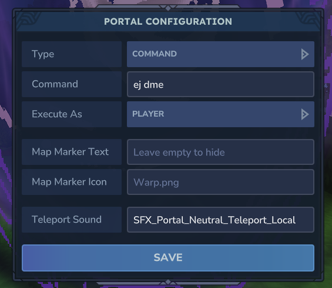

# EZJoin

**This is a very simple, unsafe, plugin to join other servers from your server** 
# **This was made for a specific server AND WILL NOT WORK AS INTENDED FOR YOU**

# How To Use EZJoin

**You will need EZJoin and [Admin Portals](https://www.curseforge.com/hytale/mods/admin-portals) 
installed on your server**

- Place a portal from **admin portals** down and run **/adminportals configmode toggle** 
to enable configuration of the portal. 
- [F] Interact with the portal
- Type will always be Command
- Command will be ej \<partner\>
- Execute As needs to be switched from SERVER -> PLAYER
- Save
- Run **/adminportals configmode toggle** again to disable Portal Configuration
- 
